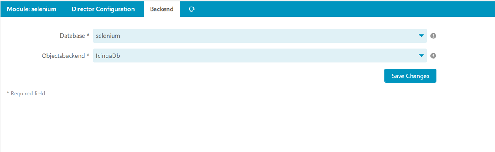

# Installation <a id="module-selenium-installation"></a>

## Requirements <a id="module-selenium-installation-requirements"></a>

* Icinga Web 2 (&gt;= 2.12.2)
* Icinga Director (&gt;= 1.11.2)
* PHP (&gt;= 7.3)
* php-zip
* google-chrome-stable

The Icinga Web 2 `monitoring` or `icingadb` module needs to be configured and enabled.


If you want to use the director integration the Icinga Web 2 `director` module needs to be configured and enabled.

## Installation from .tar.gz <a id="module-selenium-installation-manual"></a>

Download the latest version and extract it to a folder named `selenium`
in one of your Icinga Web 2 module path directories.

## Enable the newly installed module <a id="module-selenium-installation-enable"></a>

Enable the `selenium` module either on the CLI by running

```sh
icingacli module enable selenium
```

Or go to your Icinga Web 2 frontend, choose `Configuration` -&gt; `Modules`, chose the `selenium` module and `enable` it.

It might afterwards be necessary to refresh your web browser to be sure that
newly provided styling is loaded.

## Setting up the Database

### Setting up a MySQL or MariaDB Database

The module needs a MySQL/MariaDB database with the schema that's provided in the `/usr/share/icingaweb2/modules/selenium/schema/mysql.schema.sql` file.

You can use the following sample command for creating the MySQL/MariaDB database. Please change the password:

```
CREATE DATABASE selenium;
GRANT CREATE, SELECT, INSERT, UPDATE, DELETE, DROP, ALTER, CREATE VIEW, INDEX, EXECUTE ON selenium.* TO selenium@localhost IDENTIFIED BY 'secret';
```

After, you can import the schema using the following command:

```
mysql -p -u root selenium < /usr/share/icingaweb2/modules/selenium/schema/mysql.schema.sql
```

## Provide sudo permissions for www-data

In order for the HealthHooks to work you need to provide the following entries in the sudoers file:

```
www-data ALL = NOPASSWD: /usr/bin/systemctl restart icinga-selenium.service
www-data ALL = NOPASSWD: /usr/bin/systemctl status icinga-selenium.service
```
If your webserver group is not www-data adapt this lines to fit your needs

## Download the Selenium Chrome Web Driver

The module needs a webdriver placed under `/etc/icingaweb2/modules/selenium/binaries/chromedriver`.

You can use the following command for downloading the right chrome driver for your chrome version:
If you run this as your webserver user the selenium module can later update the webdriver too.
> This ony works if the chrome version is not too old. Please update google-chrome-stable before running the init command


```
sudo -u www-data icingacli selenium init --with-commands
```


## Icinga Selenium Chrome Web Driver Service 

You have to configure this as a `systemd` service yourself by just copying the example service definition from `/usr/share/icingaweb2/modules/selenium/contrib/systemd/icinga-selenium.service`
to `/etc/systemd/system/icinga-selenium.service`.

```
cp /usr/share/icingaweb2/modules/selenium/contrib/systemd/icinga-selenium.service /etc/systemd/system/icinga-selenium.service
```


You can run the following command to enable and start the daemon.
```
systemctl enable --now icinga-selenium.service
```

## Set a Database / Choose a backend - Web

Create a Database as usual and set is a database for the selenium module

Here you can also decide if you want to query hosts for IcingaDb or ido (monitoring)



## Config via CLI

### Select a database resource

You can run the following command choose a resource:

```
sudo -u www-data icingacli selenium set resource --name NAMEOFYOURDATABASERESOURCE
```

### Select a backend for objects

You can run the following command select a backend for objects:

```
sudo -u www-data icingacli selenium set backend --name icingadb
```

or

```
sudo -u www-data icingacli selenium set backend --name monitoring
```

### Image path

By default, the image path is `/etc/icingaweb2/modules/selenium/images` make sure this or that path that you set in the module settings have the following permissions:
Use `nagios` or the actual user that runs your icinga process.
Use `www-data` or the actual user that runs your webserver process.
```
chown -R nagios:icingaweb2  /etc/icingaweb2/modules/selenium/images
chmod -R 770  /etc/icingaweb2/modules/selenium/images
```
