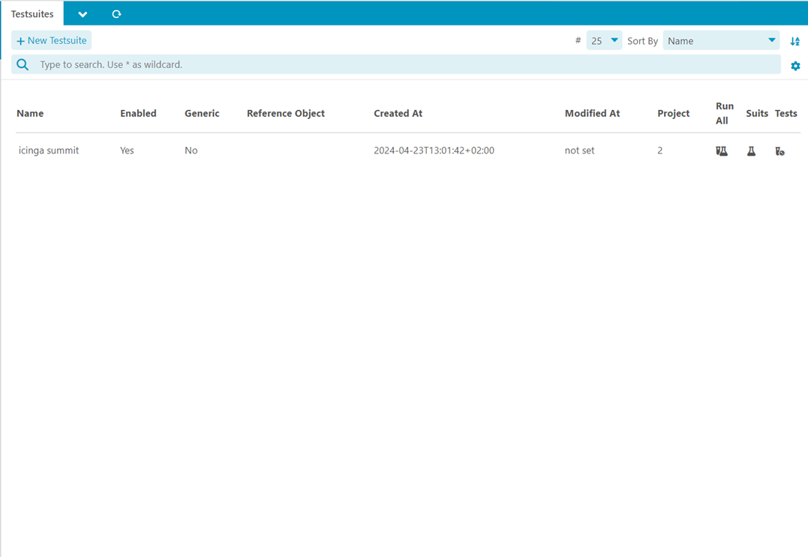

# Configuration <a id="module-selenium-configuration"></a>

## Director Configuration  <a id="module-selenium-configuration-module"></a>

### Set via Web
You can use the icingacli to run tests as an icinga check.
The check commands can automatically created by this module if you use Icinga Director.


### Set field category via CLI

You can use the icingacli to set a category for the director command fields:
This category must be present in Icinga Director

```
sudo -u www-data icingacli selenium set category --name 'URL/HTTP Checks'
```

### Create director commands via CLI

You can use the icingacli to create the commands for Icinga Director:

```
icingacli selenium create command
```


## Project Configuration  <a id="module-selenium-configuration-project"></a>

To use this module you need to create project first.
These projecta can be used to set permissions for everything that is linked to a project. 


| Option                | Required | Description                              |
| --------------------- | -------- | -----------------------------------      |
| Name                  | **yes**  | Name of the project                        |
| Enabled               | no       | Enabled or disabled                    |
| Created At            | no       | Time the project was created                 |
| Modified At           | no       | Time the project was modified                    |

In your IcingaWeb2 Role Settings you can filter by project.name using the IcingaDb filter syntax.
> project.name~test

## Testsuite Configuration  <a id="module-selenium-configuration-testsuite"></a>

Testsuites contain the Selenium IDE tests. Use the Selenium IDE to generate a test suite and put its content into the data field




| Option                | Required | Description                              |
| --------------------- | -------- | -----------------------------------      |
| Name                  | **yes**  | Name of the project                        |
| Data               | no       | The Selenium IDE testdata                    |
| Enabled               | no       | Enabled or disabled                    |
| Generic               | no       | This option activates the Icinga object variable injection, you can use for example $host.name$ in your data field to generate generic testcases but apply host or service data to it. Using this makes the reference object required                    |
| Created At            | no       | Time the project was created                 |
| Modified At           | no       | Time the project was modified                    |
| Sleep           | no       | The sleep time between the execution of a Selenium Command and the screenshot for the report                   |
| Project           | no       | The project this test suites are mend for                   |
| Reference Object           | no       | The reference object that will be queried for manual execution, make sure the Icinga object vars are present for this object             |


In your IcingaWeb2 Role Settings you can filter by project.name using the IcingaDb filter syntax.
> project.name~test

