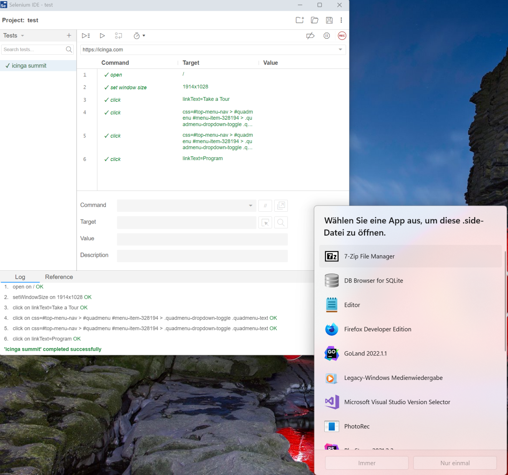

# Usage <a id="module-selenium-usage"></a>

## Module Usage Web Interface <a id="module-selenium-usage-web"></a>

Start your Selenium IDE


Create or load a project


Click on REC (record) and provide a base url


Provide a base url


Click around and generate a test case


Stop recording when your are finished


Run the test to confirm it works.


Save the project and open it in editor




Goto the IcingaWeb2 module and create a new testsuite


Run the testsuite or parts of it manually


You will be redirected to the summary of the testrun


## Module Usage CLI <a id="module-selenium-usage-cli"></a>


This is the selenium cli check command you can use this as icinga check command:

```
sudo -u www-data icingacli selenium check
```

The command supports the followinf arguments:

| Option                | Required | Description                              |
| --------------------- | -------- | -----------------------------------      |
| --project                  | **yes**  | Name of the project                        |
| --testsuite               | **yes**   | Name of the testsuite                  |
| --suite-id               | no       | The selenium IDE allows multiple testsuites in one export, you can reference an id here to only run a specific testsuite                 |
| --test-id               | no       | The selenium IDE allows multiple tests in one suite, you can reference an id here to only run a specific test                 |
| --with-images         | no       | The cli command does not save images by default, you can turn that on here.                |
| --minimal           | no       | If enabled the test will be saved to the database with just the result (failed/success)                    |
| --host           | no       | The hostname that is applied to a generic testsuite                  |
| --service    | no       | The servicename that is applied to a generic testsuite, this service must be present on the host                   |
| --run-reference    | no       | A run-reference if you want to query that specific testrun later on                  |
| --critical    | no       | Overall test time as Icinga Threshold to return a critical                    |
| --warning    | no       | Overall test time as Icinga Threshold to return a warning                   |

